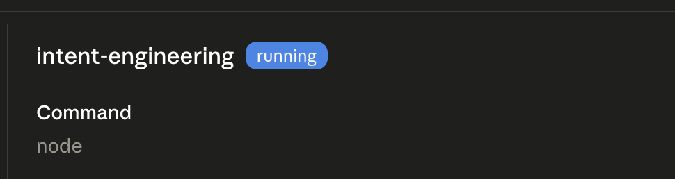

# intent-engineering

`intent-engineering` is an MCP server that exposes three tools — `audit_intent_spec`, `generate_intent_spec_scaffold`, and `assess_retrofit_level` — letting any MCP-aware client (Claude Desktop, Cursor, Anti-Gravity) review, scaffold, and triage agent intent specs against a 9-section unified template synthesized from production-agent research.

Most agent failures aren't reasoning failures — they're intent failures. The spec is vague, the stop rules are missing, the outcome is an activity disguised as a state. This server makes that gap auditable from inside the harness the agent already runs in. The full reasoning, the rejected alternatives, and what would break in v0 live in [`docs/EXPLANATION.md`](docs/EXPLANATION.md).

## Three tools

| Tool | Input | Output |
|---|---|---|
| `audit_intent_spec` | A spec (`spec_text` or `file_path`) | Score out of 25, per-section findings, detected anti-patterns, top 3 recommendations |
| `generate_intent_spec_scaffold` | `kind` (blank / level-1-mvr / full-9-section), optional hints | A paste-ready YAML scaffold + next-step actions |
| `assess_retrofit_level` | An existing prompt or SKILL.md | Recommended retrofit level (L1 / L2 / L3) with blast-radius + complexity + autonomy reasoning |

The 25-item validation checklist, 5 fatal anti-patterns, 4 autonomy levels, and 9-section template all come from the canonical [`intent-engineering` skill](https://github.com/seanwinslow28/claude-code-superuser-pack/tree/main/.claude/skills/intent-engineering). The MCP server is a thin protocol adapter, not a fork.

## Quickstart

Requires Node 20+ and an MCP-aware client (Claude Desktop, Cursor, etc.).

```bash
git clone https://github.com/seanwinslow28/sw-mcp-intent-engineering.git
cd sw-mcp-intent-engineering
npm install
npm run build
```

Then add the server to your Claude Desktop config at `~/Library/Application Support/Claude/claude_desktop_config.json`:

```json
{
  "mcpServers": {
    "intent-engineering": {
      "command": "node",
      "args": ["<ABSOLUTE_PATH_TO_REPO>/build/index.js"]
    }
  }
}
```

Restart Claude Desktop. Open Settings → Developer to confirm the server shows as `running`:



The three tools then appear in the tool list under `intent-engineering` in any new conversation.

## Try it

Paste this into Claude Desktop after the server is connected:

> Run `audit_intent_spec` on this spec:
>
> ```
> ## Objective
> Make support tickets resolve faster.
>
> ## Outcomes
> - Tickets close in <2h
> - CSAT stays high
>
> ## Stop Rules
> (none)
> ```

You'll get back a score out of 25, a list of detected anti-patterns (this spec hits at least three), and three concrete recommendations to fix it. The full I/O contract lives in [`docs/v0-scope.md`](docs/v0-scope.md) §4.

## Dogfood result

The canonical `intent-engineering` SKILL.md, audited by its own MCP server, scores **23/25 with zero anti-patterns detected**. Seven sections pass cleanly; two return warnings (outcome measurability and a health-metric behavioral-adjustment phrasing). The tool eats its own dog food and the dog food is mostly nutritious.

## Limitations

The v0 audit is opinionated about heading structure. It expects explicit `## Objective` and `## Desired Outcomes` headings to score sections. When tested against four other skills from a 117-skill personal library, the four scored 1/25 each — not because the skills are bad, but because they express intent through different heading vocabularies (`## When to Use`, `## How to Apply`, etc.). This is a v0 design choice, not a bug. A v0.2 enhancement would add a heading-vocabulary mapper so the audit recognizes equivalent sections under different labels.

Other v0 boundaries worth naming up front:

- **Read-only.** No tool writes files. `assess_retrofit_level` recommends; it does not retrofit. A v0.2 `apply_retrofit` would live behind explicit user confirmation.
- **Stdio transport only.** No Streamable HTTP, no SSE, no remote hosting. Run it locally next to your client.
- **No `prompts` or `resources` primitives.** Three tools and that's it. Adding more before the surface is stable would be premature.

## Project layout

```
sw-mcp-intent-engineering/
├── src/
│   ├── index.ts                    # MCP server boot + tool registration
│   └── intent/
│       ├── audit.ts                # audit_intent_spec logic
│       ├── scaffold.ts             # generate_intent_spec_scaffold logic
│       ├── retrofit.ts             # assess_retrofit_level logic
│       ├── checklist.ts            # 25-item validation checklist
│       ├── anti-patterns.ts        # 5 fatal anti-pattern detectors
│       ├── parser.ts               # YAML frontmatter + markdown heading parser
│       └── templates/              # YAML scaffolds (blank / level-1-mvr / full-9-section)
├── docs/
│   ├── v0-scope.md                 # binding scope-lock for v0
│   ├── EXPLANATION.md              # 4Q comprehension artifact (why MCP, what would break, what I learned)
│   └── claude-code-responses-and-tests/   # archived phase-verification outputs
├── package.json
├── tsconfig.json
├── server.json                     # registry metadata
├── CHANGELOG.md
├── README.md
└── LICENSE
```

`src/index.ts` is a thin protocol adapter. All tool logic lives in `src/intent/*`.

## Build discipline

- SDK pinned at `@modelcontextprotocol/sdk@1.29.0` (stable v1.x line, not the v2 pre-alpha)
- All logging goes to `console.error`. A `prepublishOnly` grep guard fails the build if any `console.log` appears in `src/`
- Tool implementations import the validation checklist, anti-pattern definitions, and template strings from local modules that mirror the skill. They do not paraphrase or reinvent skill content
- Scope changes require explicit approval in [`CHANGELOG.md`](CHANGELOG.md) before code is written

## Further reading

- [`docs/EXPLANATION.md`](docs/EXPLANATION.md) — the 4Q comprehension artifact (what this is, why this approach, what would break, what I learned)
- [`docs/v0-scope.md`](docs/v0-scope.md) — binding v0 scope-lock and ship gate
- [seanwinslow.com/transactions/intent-engineering-mcp](https://seanwinslow.com/transactions/intent-engineering-mcp) — deep-dive write-up with Loom demo

## License

MIT. See [`LICENSE`](LICENSE).
